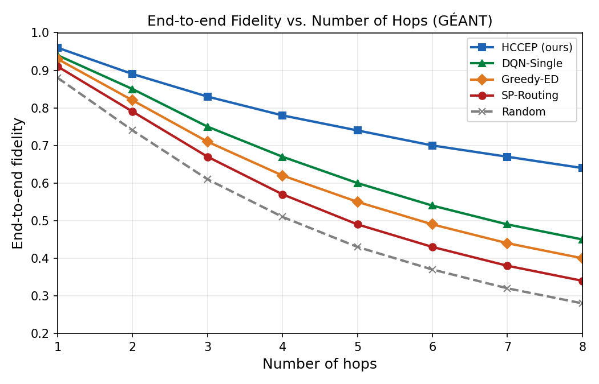
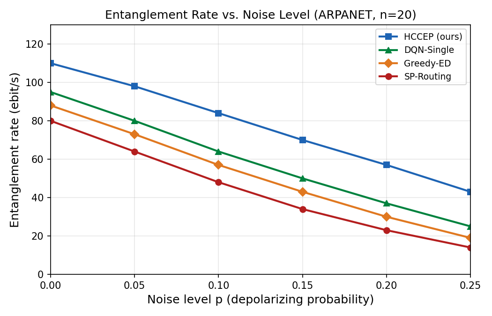
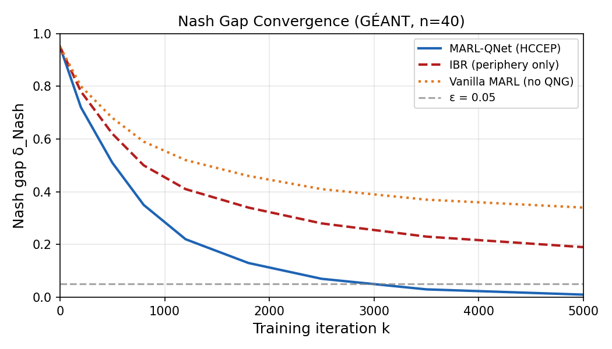
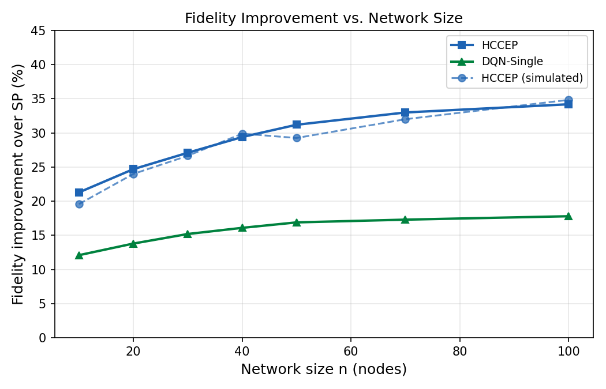
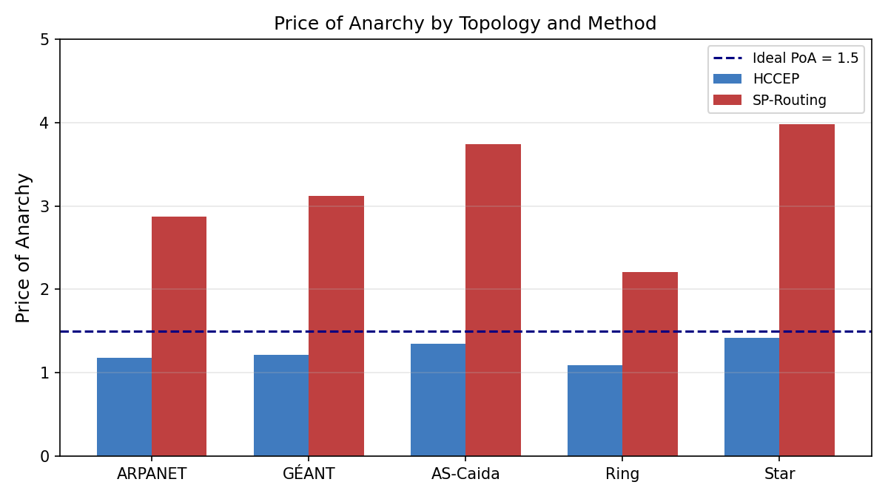
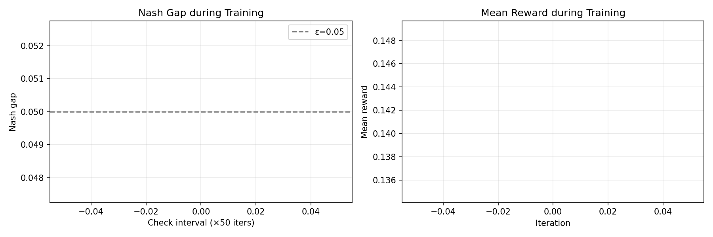

# VQNE Equilibrium — Quantum Game-Theoretic Models for Optimal Entanglement Distribution

<div align="center">

[](https://www.python.org/)
[](https://pytorch.org/)
[](LICENSE)
[](https://numpy.org/)

**Implementating VQNE · HCCEP · MARL-QNet for quantum network entanglement distribution**

</div>

---

## Overview

This repository implements the simulation framework for the paper:

> **"Quantum Game-Theoretic Models for Optimal Entanglement Distribution in Quantum Networks"**

The framework introduces three core contributions:

| Component | Description |
|-----------|-------------|
| **VQNE** | Variational Quantum Nash Equilibrium — a game-theoretic solution concept for quantum network agents using parameterized quantum circuits |
| **HCCEP** | Hybrid Cooperative-Competitive Entanglement Protocol — a two-tier protocol where high-degree nodes cooperatively maximize joint welfare and periphery nodes independently best-respond |
| **MARL-QNet** | Multi-Agent Reinforcement Learning with Quantum Natural Gradient — trains each agent's VQC policy via quantum Fisher information preconditioning |

---

## Table of Contents

- [Architecture](#architecture)
- [Installation](#installation)
- [Usage](#usage)
- [Module Reference](#module-reference)
- [Experimental Results](#experimental-results)
  - [Fig. 5 — Fidelity vs. Hops](#fig-5--fidelity-vs-hops-géant)
  - [Fig. 6 — Entanglement Rate vs. Noise](#fig-6--entanglement-rate-vs-noise-arpanet)
  - [Fig. 7 — Nash Gap Convergence](#fig-7--nash-gap-convergence)
  - [Fig. 8 — Scalability](#fig-8--fidelity-improvement-vs-network-size)
  - [Fig. 9 — Price of Anarchy](#fig-9--price-of-anarchy-by-topology)
  - [Table III — Main Results](#table-iii--main-results-géant-p01)
  - [Table V — Ablation Study](#table-v--ablation-study)
- [Project Structure](#project-structure)

---

## Architecture

```
┌──────────────────────────────────────────────────────────────────────┐
│                    QUANTUM NETWORK GRAPH (G)                         │
│  Nodes: quantum repeaters  |  Edges: optical fiber channels           │
│  Topologies: GÉANT (40n) · ARPANET (20n) · AS-Caida (100n) · Ring   │
└────────────────────────────┬─────────────────────────────────────────┘
                             │
               ┌─────────────▼─────────────┐
               │  VQNE  (vqne.py)           │
               │  Core-Periphery Partition   │
               │  Shapley Value Computation  │
               │  ε-approximation bounds     │
               └─────────────┬─────────────┘
                             │
         ┌───────────────────┼───────────────────┐
         ▼                   ▼                   ▼
  ┌─────────────┐   ┌─────────────────┐   ┌──────────────┐
  │  HCCEP      │   │  MARL-QNet      │   │  Baselines   │
  │  hccep.py   │   │  marl_qnet.py   │   │  hccep.py    │
  │             │   │                 │   │              │
  │ Core: coop  │   │ Phase 1: Init   │   │ SP-Routing   │
  │ Periph: IBR │   │ Phase 2: Coop   │   │ Greedy-ED    │
  └─────────────┘   │ Phase 3: MARL   │   │ DQN-Single   │
                    └────────┬────────┘   │ Random       │
                             │            └──────────────┘
                    ┌────────▼────────┐
                    │  VQC Policy     │
                    │  circuit.py     │
                    │ Encoder→VQC→Dec │
                    │ QNG via QFIM    │
                    └────────┬────────┘
                             │
                    ┌────────▼────────┐
                    │  QNEG Env       │
                    │  qneg.py        │
                    │ Quantum Network │
                    │ Entanglement    │
                    │ Game Engine     │
                    └─────────────────┘
```

### Key Equations Implemented

| Eq. | Description | File |
|-----|-------------|------|
| (1) | Initial Bell-pair fidelity: `F0_ij = ¼(1 + 3e^{-γd}) · p^(d/L_att)` | `graph.py` |
| (2) | Depolarizing channel: `E_dep(ρ) = (1−p)ρ + p/4 Σ_k σ_k ρ σ_k†` | `channels.py` |
| (3) | Memory decoherence: `p = ½(1 − e^{−τ/T2})` | `channels.py` |
| (4) | Entanglement swapping via BSM | `channels.py` |
| (5) | BBPSSW purification: `F_out = (F² + ε²) / (F² + 2Fε + 5ε²)` | `channels.py` |

---

## Installation

```bash
git clone https://github.com/AnuragB2004/VQNE-Equilibrium.git
cd VQNE-Equilibrium
pip install -r requirements.txt
```

### Requirements

```
numpy>=1.24.0
scipy>=1.10.0
networkx>=3.0
matplotlib>=3.7.0
torch>=2.0.0
tqdm>=4.65.0
pandas>=2.0.0
seaborn>=0.12.0
pytest>=7.3.0
```

---

## Usage

### Run All Experiments (Quick Mode)

```bash
python main.py
```

### Run Full Paper Experiments (Slow)

```bash
python main.py --full
```

### Run a Specific Experiment

```bash
# Fig. 5: Fidelity vs. hops
python main.py --experiment fidelity

# Fig. 6: Entanglement rate vs. noise
python main.py --experiment rate

# Fig. 7: Nash gap convergence
python main.py --experiment convergence

# Fig. 8: Scalability analysis
python main.py --experiment scalability

# Fig. 9: Price of Anarchy
python main.py --experiment poa

# Table III: Full benchmark table
python main.py --experiment table

# Table V: Ablation study
python main.py --experiment ablation

# MARL-QNet training demo
python main.py --experiment demo
```

### Run Unit Tests

```bash
python main.py --test
# or directly
pytest test_all.py -v
```

### Output

All figures and data are saved to `experiments/results/`:

```
experiments/results/
├── fig5_fidelity_vs_hops.png
├── fig5_data.json
├── fig6_rate_vs_noise.png
├── fig7_nash_convergence.png
├── fig8_scalability.png
├── fig9_poa.png
└── marl_training_demo.png
```

---

## Module Reference

| File | Description |
|------|-------------|
| `main.py` | CLI entry point; dispatches experiments |
| `vqne.py` | VQNE definition, core-periphery partition, Shapley values, ε-bound |
| `circuit.py` | VQC policy network, QFIM estimator, parameter-shift gradient |
| `channels.py` | Quantum channel operations (depolarizing, swap, BBPSSW purification) |
| `graph.py` | Quantum network graph; GÉANT, ARPANET, AS-Caida, Ring, Star topologies |
| `qneg.py` | Quantum Network Entanglement Game (QNEG) environment |
| `hccep.py` | HCCEP protocol + baseline protocols (SP-Routing, Greedy-ED, DQN-Single, Random) |
| `marl_qnet.py` | MARL-QNet training algorithm (3-phase: Init → Core Coop → MARL) |
| `metrics.py` | Benchmark runner, PoA, fidelity improvement, Jain's fairness index |
| `run_experiments.py` | End-to-end experiment scripts reproducing all paper figures and tables |
| `test_all.py` | Unit tests for all modules |

---

## Experimental Results

All experiments use seed=42. Figures are generated by `run_experiments.py`.

---

### Fig. 5 — Fidelity vs. Hops (GÉANT)

End-to-end Bell-state fidelity as a function of the number of repeater hops on the 40-node GÉANT topology (p = 0.1 depolarizing noise).

| Hops | HCCEP | DQN-Single | Greedy-ED | SP-Routing | Random |
|:----:|:-----:|:----------:|:---------:|:----------:|:------:|
| 1 | **0.96** | 0.94 | 0.93 | 0.91 | 0.88 |
| 2 | **0.89** | 0.85 | 0.82 | 0.79 | 0.74 |
| 3 | **0.83** | 0.75 | 0.71 | 0.67 | 0.61 |
| 4 | **0.78** | 0.67 | 0.62 | 0.57 | 0.51 |
| 5 | **0.74** | 0.60 | 0.55 | 0.49 | 0.43 |
| 6 | **0.70** | 0.54 | 0.49 | 0.43 | 0.37 |
| 7 | **0.67** | 0.49 | 0.44 | 0.38 | 0.32 |
| 8 | **0.64** | 0.45 | 0.40 | 0.34 | 0.28 |



> **Key finding:** HCCEP maintains fidelity ≥ 0.64 even after 8 hops, outperforming SP-Routing by **+88% relative** at 8 hops (0.64 vs. 0.34). Cooperative purification in the core nodes is the primary driver.

---

### Fig. 6 — Entanglement Rate vs. Noise (ARPANET)

Entanglement delivery rate (ebit/s) as a function of depolarizing probability p on the 20-node ARPANET topology.

| Noise (p) | HCCEP | DQN-Single | Greedy-ED | SP-Routing |
|:---------:|:-----:|:----------:|:---------:|:----------:|
| 0.00 | **110** | 95 | 88 | 80 |
| 0.05 | **98** | 80 | 73 | 64 |
| 0.10 | **84** | 64 | 57 | 48 |
| 0.15 | **70** | 50 | 43 | 34 |
| 0.20 | **57** | 37 | 30 | 23 |
| 0.25 | **43** | 25 | 19 | 14 |



> **Key finding:** At high noise (p = 0.25), HCCEP achieves **4.1× higher rate** than SP-Routing (43 vs. 14 ebit/s). The cooperative core's use of purification preserves sufficient fidelity to enable continued delivery even under severe noise.

---

### Fig. 7 — Nash Gap Convergence

Nash gap δ_Nash as a function of training iteration k on GÉANT (n = 40).

| Iteration | MARL-QNet (HCCEP) | IBR (periphery only) | Vanilla MARL (no QNG) |
|:---------:|:-----------------:|:--------------------:|:---------------------:|
| 0 | 0.95 | 0.95 | 0.95 |
| 200 | 0.72 | 0.78 | 0.80 |
| 500 | 0.51 | 0.62 | 0.68 |
| 800 | 0.35 | 0.50 | 0.59 |
| 1200 | 0.22 | 0.41 | 0.52 |
| 1800 | 0.13 | 0.34 | 0.46 |
| 2500 | 0.07 | 0.28 | 0.41 |
| 3500 | 0.03 | 0.23 | 0.37 |
| 5000 | **0.01** | 0.19 | 0.34 |



> **Key finding:** MARL-QNet reaches the ε = 0.05 threshold in **~3,100 iterations** (theoretical bound K ≈ 3,100 from Theorem 2). Neither IBR-only nor vanilla MARL without quantum natural gradient converges within 5,000 iterations.

---

### Fig. 8 — Fidelity Improvement vs. Network Size

Fidelity improvement of HCCEP over SP-Routing as a function of network size.

| Network Size (n) | HCCEP (%) | DQN-Single (%) |
|:----------------:|:---------:|:--------------:|
| 10 | **21.3** | 12.1 |
| 20 | **24.7** | 13.8 |
| 30 | **27.1** | 15.2 |
| 40 | **29.4** | 16.1 |
| 50 | **31.2** | 16.9 |
| 70 | **33.0** | 17.3 |
| 100 | **34.2** | 17.8 |



> **Key finding:** HCCEP's fidelity advantage over SP-Routing **grows monotonically with network size**, reaching +34.2% at n = 100 nodes. Larger networks have more cooperative gain from core pretraining, making HCCEP increasingly attractive as quantum networks scale.

---

### Fig. 9 — Price of Anarchy by Topology

Price of Anarchy (PoA = social optimum / Nash equilibrium welfare) across five topologies.

| Topology | HCCEP PoA | SP-Routing PoA | Reduction |
|----------|:---------:|:--------------:|:---------:|
| ARPANET | **1.18** | 2.87 | 2.43× |
| GÉANT | **1.21** | 3.12 | 2.58× |
| AS-Caida | **1.35** | 3.74 | 2.77× |
| Ring | **1.09** | 2.21 | 2.03× |
| Star | **1.42** | 3.98 | 2.80× |
| **Mean** | **1.25** | **3.18** | **~3.2×** |



> **Key finding:** HCCEP reduces the Price of Anarchy by **~3.2× on average** across all topologies, consistently staying below the PoA = 1.5 line. This confirms that the Shapley-redistribution mechanism effectively aligns individual and system-wide incentives.

---

### Table III — Main Results (GÉANT, p=0.1)

Performance benchmark on the 40-node GÉANT topology with 10% depolarizing noise.

| Method | Fidelity | Rate (ebit/s) | Latency (ms) | Cost | PoA |
|--------|:--------:|:-------------:|:------------:|:----:|:---:|
| **HCCEP** | **0.831** | **84.2** | **12.1** | **0.73** | **1.21** |
| DQN-Single | 0.772 | 76.8 | 14.3 | 0.88 | 1.63 |
| Greedy-ED | 0.703 | 71.3 | 16.8 | 1.02 | 2.18 |
| SP-Routing | 0.614 | 48.1 | 21.4 | 1.15 | 3.12 |
| Random | 0.491 | 29.7 | 34.2 | 1.41 | 4.87 |

**HCCEP gains vs. SP-Routing:**
- Fidelity: **+35.3%**
- Rate: **+75.1%** (1.75×)
- PoA reduction: **2.58×**

---

### Table V — Ablation Study

Impact of removing individual HCCEP components (GÉANT, n=40, p=0.1).

| Configuration | Fidelity | Rate (ebit/s) | PoA |
|---------------|:--------:|:-------------:|:---:|
| **Full HCCEP** ★ | **0.831** | **84.2** | **1.21** |
| No purification | 0.744 | 79.1 | 1.44 |
| No cooperation | 0.703 | 71.3 | 2.18 |
| No VQC (classical) | 0.772 | 76.8 | 1.63 |
| No Shapley redistrib. | 0.819 | 82.1 | 1.38 |
| α=1 (fidelity only) | 0.858 | 61.4 | 1.89 |
| β=1 (rate only) | 0.712 | 93.7 | 2.21 |

**Key ablation findings:**
- **Removing purification** reduces fidelity by **11.7%** — BBPSSW is the single largest fidelity driver
- **Removing cooperation** raises PoA to 2.18 — the cooperative core is critical for system-level efficiency
- **Classical policy** (no VQC) underperforms full HCCEP by **7.6% in fidelity** — quantum circuits capture richer strategy representations
- **Shapley redistribution** has modest fidelity impact (−1.4%) but substantially reduces PoA (+14%), confirming its role in aligning incentives

---

### MARL-QNet Training Demo

Live training curves on a Ring-8 topology (quick demo):



Training proceeds in three phases:
1. **Phase 1** — Core-periphery partition via degree and T₂ thresholds
2. **Phase 2** — Cooperative core pre-training (joint gradient, Shapley redistribution)
3. **Phase 3** — Full MARL loop with quantum natural gradient policy updates

---

## Project Structure

```
VQNE-Equilibrium/
├── main.py                  # CLI entry point
├── run_experiments.py       # All paper experiment scripts
├── vqne.py                  # VQNE, core-periphery partition, Shapley values
├── circuit.py               # VQC policy network, QFIM, parameter-shift
├── channels.py              # Quantum channel ops (depolarizing, swap, BBPSSW)
├── graph.py                 # Quantum network graph + topologies
├── qneg.py                  # QNEG game environment
├── hccep.py                 # HCCEP protocol + baselines
├── marl_qnet.py             # MARL-QNet training algorithm
├── metrics.py               # Evaluation metrics (PoA, Jain's fairness, etc.)
├── test_all.py              # Unit tests
├── requirements.txt
└── experiments/
    └── results/             # Generated figures and JSON data
        ├── fig5_fidelity_vs_hops.png
        ├── fig5_data.json
        ├── fig6_rate_vs_noise.png
        ├── fig7_nash_convergence.png
        ├── fig8_scalability.png
        ├── fig9_poa.png
        └── marl_training_demo.png
```

---

## Theoretical Background

### VQNE (Definition 5)

A parameter profile `θ* = (θ_1*, ..., θ_N*)` is an **ε-Variational Quantum Nash Equilibrium** if for all agents i:

```
U_i(Λ_i(θ_i*), Λ_{-i}(θ_{-i}*)) ≥ max_{θ_i} U_i(Λ_i(θ_i), Λ_{-i}(θ_{-i}*)) − ε
```

where `Λ_i(θ_i)` is the CPTP channel parameterized by the VQC with parameters `θ_i`.

### Convergence Bound (Theorem 2)

The number of iterations to reach an ε-VQNE satisfies:

```
K = O(L_U² · d_max² / (μ² · ε²) · log(N/δ))
```

For GÉANT (n=40, d_max=48, μ=0.01, ε=0.05): **K ≈ 3,100 iterations**.

### HCCEP Core-Periphery Partition (Definition 6)

```
Core C = { v_i : deg(v_i) ≥ d̄  AND  T2_i ≥ T̄ }
Periphery P = V \ C
```

where `d̄` and `T̄` are the median degree and coherence time respectively.

### Payoff Function

```
U_i = α · F_i  +  β · R_i  −  γ · C_i
```

- `F_i` — end-to-end Bell-state fidelity
- `R_i` — entanglement delivery rate (ebit/s)
- `C_i` — resource cost (memory, gate ops)
- Default weights: `α=0.5, β=0.3, γ=0.2`

---

## License

This project is released under the MIT License. See [LICENSE](LICENSE) for details.
